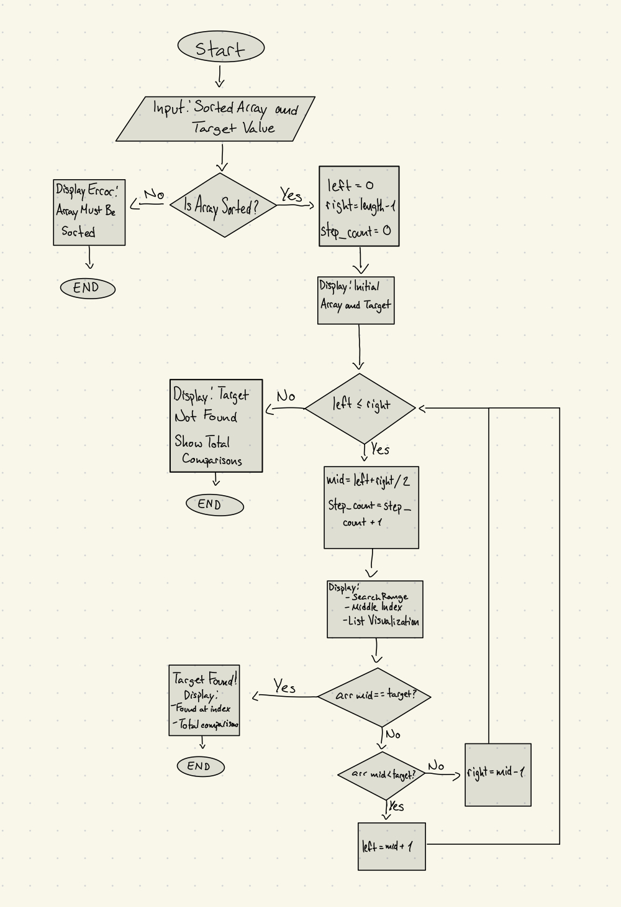

# Binary-Search-Visualization

For this final project for the CISC121 class I have decided to create a visualization of the Binary Search algorithm. This program allows its users to enter a sorted list and a target value inside the list, then watch how the algorithm would check the middle element of the list, narrow down the search space, and finally finding the target value. 

Demo Screenshot:

**Problem Breakdown & Computational Thinking:**

Binary search is a very efficient searching algorithm which its complexity is O(1) for the best case and O(log n) for the average and worst case, meaning it is a very good algorithm. It also shows us how the divide and conquer strategy works perfectly, by repeatedly halving the given list. Below is the computational thinking breakdown that I used to design this app. 

**1. Decomposition**

The Binary Search algorithm is broken into the following steps:
- Convert the user input into a list of integers 
- Make sure the list is sorted
- Set the left and right pointers
- While left <= right:
    - Compute Mid
    - Compare list[mid] with target
    - Store each step for the visualization
    - If list[mid] < target -> search the right half
    - If list[mid] > target -> search the left half 
- Return the index of the target value or "not found"
- Display all the steps with a visual interface

**2. Pattern Recognition**

Binary Search always:
- Looks for the middle element of the list 
- Eliminates half of the list every step
- Moves to the left or to the right based on comparisons

**3. Abstraction**

The visualization shows:
- The sorted list given
- The current middle, left, and right positions
- Step by step narrowing of the list
- Middle element being compared
- Total number of comparisons

The visualization hides:
- The usage of integer division
- Memory addresses
- Details about the internal pointer 

**4. Algorithm Design**

Flowchart:

Input -> Processing -> Output Flow:
- Input (via GUI)
    - Text field: A list of integers separated by commas
    - Text field: The target integer to find 

- Processing:
    - Execution of the binary search algorithm
    - Count each comparisons
    - Track each step with a visual representation

- Output (via GUI)
    - The final result (found at index __ / not found) 
    - Visual indicators that shows the search progress 
    - Text that shows step by step process
 
**Usage of HTML in code**
- In this code HTML was used, because I wanted to actually show the user how binary search works, by using a clear animation, like colored boxes and step by step change. Python alone cannot create those boxes inside a Gradio app. While Gradio provides high level inputs like text boxes, dataframes, and even image displays, it does not support styling individual list items. By using small pieces of HTML inside of Gradio, I was able to create boxes that shows the list at each step. These boxes make it easy to see which part of the list is being searched, which value is being checked, and which values are no longer needed after the list is halved. 

**Hugging Face Link**
- 

**Steps To Run**
- 

**Author & Acknowledgements**

- Author: Henrique Silverio Sponchiado
- Student ID: 20530321
- Course: CISC 121
- Institution: Queen's University
- Date: November 2025

    
