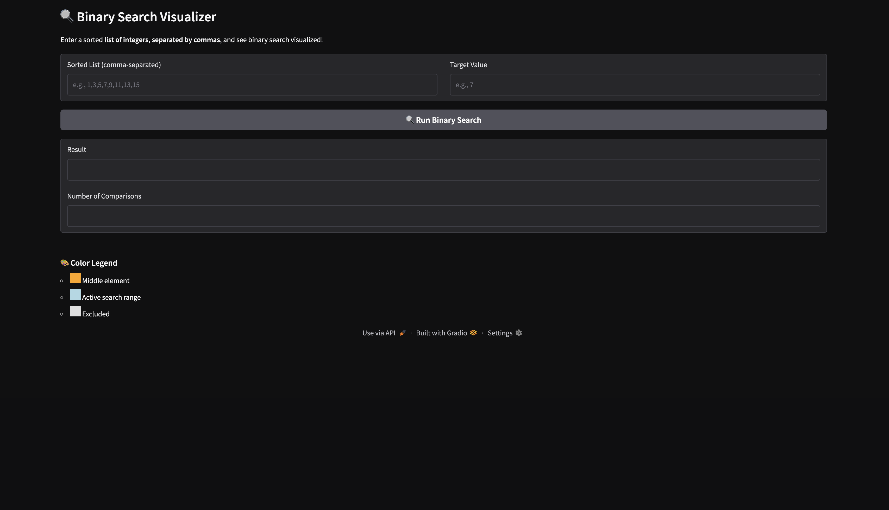
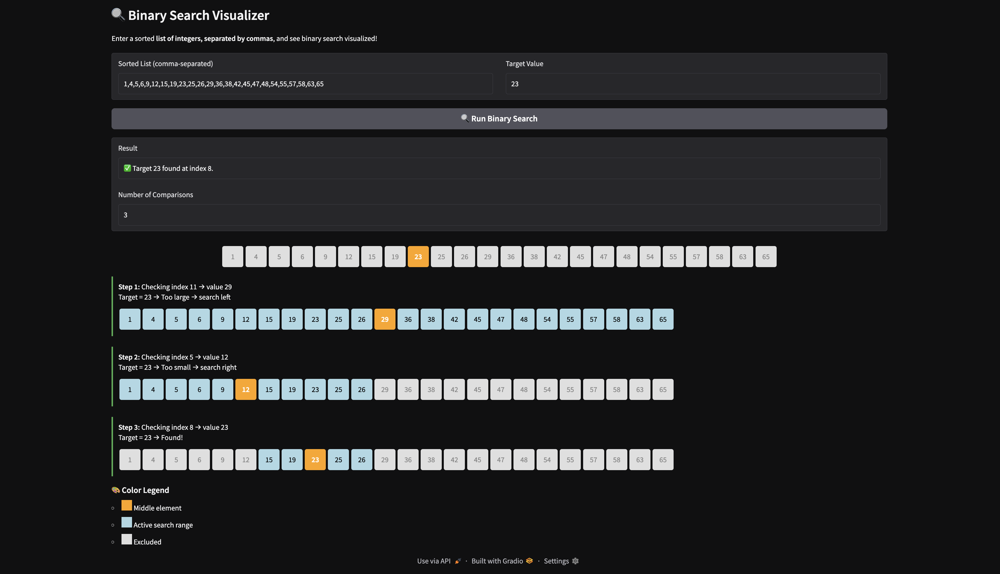
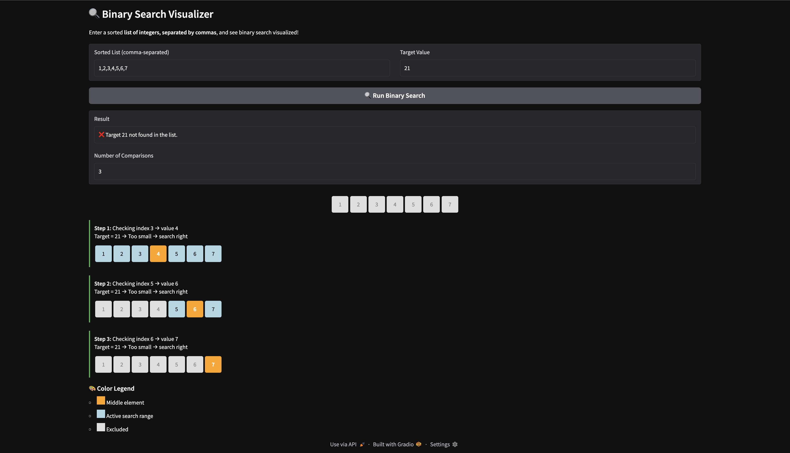
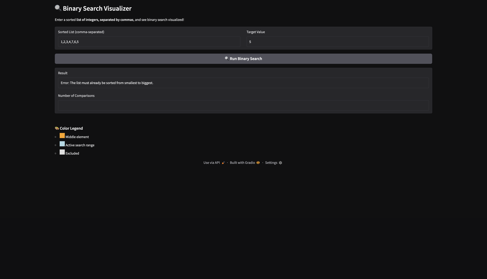
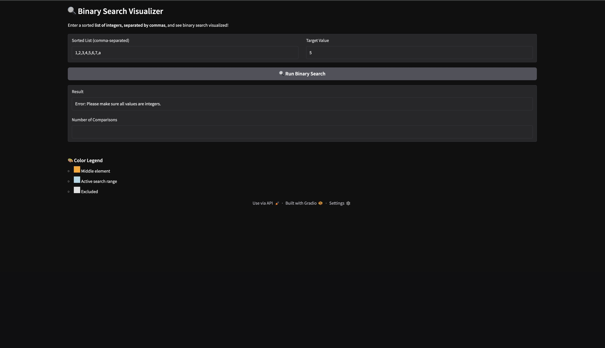

# Binary-Search-Visualization

For this final project for the CISC121 class I have decided to create a visualization of the Binary Search algorithm. This program allows its users to enter a sorted list and a target value inside the list, then watch how the algorithm would check the middle element of the list, narrow down the search space, and finally finding the target value. 

**Demo Screenshot:**

Homepage: 

Successful Search (Target Found):

Unsuccessful Search (Target Not Found):

Unsorted List:

Invalid Input Error:

**Problem Breakdown & Computational Thinking:**

Binary Search is a fast and efficient way to look for a value in a sorted list. Its best-case time is O(1) and its average and worst case is O(log n) because the algorithm keeps cutting the list in half. I chose this algorithm because many students learn the steps, but it can still be hard to picture how the search range gets smaller each time. With this project, users can actually see the process happen step by step, which makes the algorithm easier to understand. Below is the computational thinking breakdown I used to design this app.

**1. Decomposition**

The Binary Search algorithm is broken into the following steps:
- Convert the user input into a list of integers 
- Make sure the list is sorted
- Set the left and right pointers
- While left <= right:
    - Compute Mid
    - Compare list[mid] with target
    - Store each step for the visualization
    - If list[mid] < target -> search the right half
    - If list[mid] > target -> search the left half 
- Return the index of the target value or "not found"
- Display all the steps with a visual interface

**2. Pattern Recognition**

Binary Search always:
- Looks for the middle element of the list 
- Eliminates half of the list every step
- Moves to the left or to the right based on comparisons

**3. Abstraction**

The visualization shows:
- The sorted list given
- The current middle, left, and right positions
- Step by step narrowing of the list
- Middle element being compared
- Total number of comparisons

The visualization hides:
- The usage of integer division
- Memory addresses
- Details about the internal pointer 

**4. Algorithm Design**

Flowchart:

Input -> Processing -> Output Flow:
- Input (via GUI)
    - Text field: A list of integers separated by commas
    - Text field: The target integer to find 

- Processing:
    - Execution of the binary search algorithm
    - Count each comparisons
    - Track each step with a visual representation

- Output (via GUI)
    - The final result (found at index __ / not found) 
    - Visual indicators that shows the search progress 
    - Text that shows step by step process
 
**Usage of HTML in code**
-In my code, I used a little bit of HTML so I could show the binary search steps using colored boxes. Python by itself can’t create these visual boxes inside a Gradio app. Gradio is great for text and images, but it doesn’t let you style each number in a list. By adding small HTML sections, I was able to make the boxes change color at each step. This makes it easy for users to see which part of the list is being searched, which number is being checked, and which numbers have been removed from the search.

Hugging Face Link
-

**Steps To Run**
- Steps to run locally:
    - Install Python (3.10+ recommended)
    - Install Gradio: pip istall gradio
    - Download Project Files
    - Open a terminal in the project folder
    - Run: python app.py
    - Your browser will automatically open the application

**Author & Acknowledgements**

- Author: Henrique Silverio Sponchiado
- Student ID: 20530321
- Course: CISC 121
- Institution: Queen's University
- Date: November 2025

    
